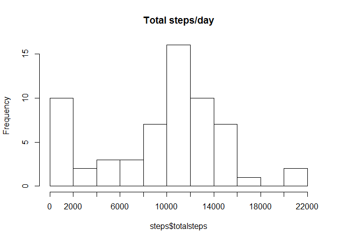
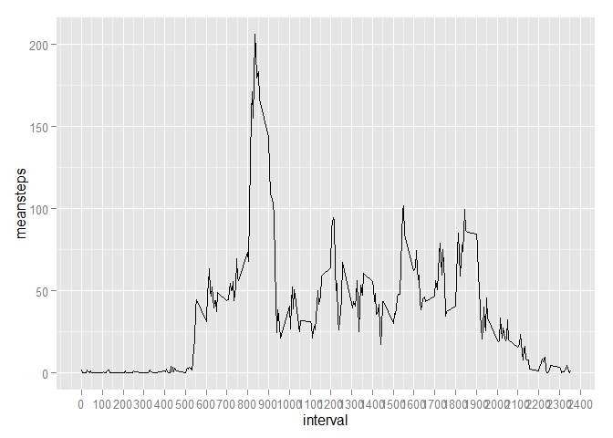
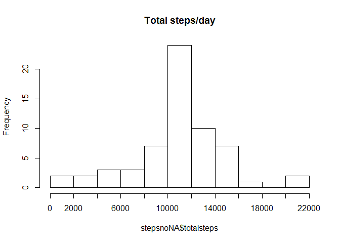
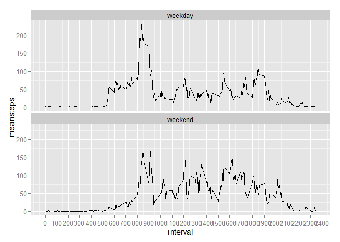

# Reproducible Research - Project 1

Opens file, loads dplyr package

```r
data <- read.csv("C:/Users/Noah/Documents/Coursera/Reproducable research/project 1/activity.csv")
library(dplyr)
```

```
## Warning: package 'dplyr' was built under R version 3.1.3
```

```
## 
## Attaching package: 'dplyr'
## 
## The following object is masked from 'package:stats':
## 
##     filter
## 
## The following objects are masked from 'package:base':
## 
##     intersect, setdiff, setequal, union
```

splits data by date, gets sum/mean/median no of steps

```r
dates <- group_by(data, date)
steps <- summarise(dates, meansteps=mean(steps, na.rm=TRUE),
                        totalsteps = sum(steps, na.rm=TRUE), 
                        mediansteps=median(steps, na.rm=TRUE))
mean(data$steps, na.rm=TRUE)
```

```
## [1] 37.3826
```

```r
median(data$steps, na.rm=TRUE)
```

```
## [1] 0
```
creates histogram

```r
hist(steps$totalsteps, breaks = 11, main = "Total steps/day",xaxt="n")
axis (side=1, at=seq(0,22000,2000), labels = seq(0,22000,2000))
```

 
splits data by interval,finds interval with highest avg

```r
interval <- group_by(data, interval)
stepsinterval <- summarise(interval, meansteps=mean(steps, na.rm=TRUE))
max <- which.max(stepsinterval$meansteps)
maxinterval<-stepsinterval[max,1]
print(paste0("the interval with highest average number of steps is ",maxinterval))
```

```
## [1] "the interval with highest average number of steps is 835"
```
creates time series plot

```r
library(ggplot2)
```

```
## Warning: package 'ggplot2' was built under R version 3.1.3
```

```r
ggplot(stepsinterval, aes(interval, meansteps)) + geom_line() + scale_x_continuous(breaks=seq(0,2500, 100))
```

 
find n/as in steps var

```r
NAvals <- is.na(data$steps)
table(NAvals)
```

```
## NAvals
## FALSE  TRUE 
## 15264  2304
```

find avg steps for each interval

```r
data2 <- data
data2$avg <- tapply(data2$steps, data2$interval, mean,na.rm=TRUE)
```

replace nas with avg steps
all values in newsteps var. that are N/As are replaced with the corresponding value in that row of the avg. variable

```r
data2$newsteps <- data2$steps
data2$newsteps[is.na(data2$newsteps)] = data2$avg[is.na(data2$newsteps)]
```

splits data (that now has no NAs) by date,gets sum/mean/median no of steps

```r
datesnoNA <- group_by(data2, date)
stepsnoNA <- summarise(datesnoNA, meansteps_noNA=mean(newsteps, na.rm=TRUE),
                   totalsteps_noNA = sum(newsteps, na.rm=TRUE), 
                   mediansteps_noNA=median(newsteps, na.rm=TRUE))
stepsnoNA
```

```
## Source: local data frame [61 x 4]
## 
##          date meansteps_noNA totalsteps_noNA mediansteps_noNA
## 1  2012-10-01       37.38260        10766.19         34.11321
## 2  2012-10-02        0.43750          126.00          0.00000
## 3  2012-10-03       39.41667        11352.00          0.00000
## 4  2012-10-04       42.06944        12116.00          0.00000
## 5  2012-10-05       46.15972        13294.00          0.00000
## 6  2012-10-06       53.54167        15420.00          0.00000
## 7  2012-10-07       38.24653        11015.00          0.00000
## 8  2012-10-08       37.38260        10766.19         34.11321
## 9  2012-10-09       44.48264        12811.00          0.00000
## 10 2012-10-10       34.37500         9900.00          0.00000
## ..        ...            ...             ...              ...
```
creates histogram

```r
hist(stepsnoNA$totalsteps, breaks = 11, main = "Total steps/day",xaxt="n")
axis (side=1, at=seq(0,22000,2000), labels = seq(0,22000,2000))
```

 

compares steps w/ and w/o NAs

```r
stepscompare <- cbind(steps, stepsnoNA[,2:4])
head(stepscompare)
```

```
##         date meansteps totalsteps mediansteps meansteps_noNA
## 1 2012-10-01       NaN          0          NA       37.38260
## 2 2012-10-02   0.43750        126           0        0.43750
## 3 2012-10-03  39.41667      11352           0       39.41667
## 4 2012-10-04  42.06944      12116           0       42.06944
## 5 2012-10-05  46.15972      13294           0       46.15972
## 6 2012-10-06  53.54167      15420           0       53.54167
##   totalsteps_noNA mediansteps_noNA
## 1        10766.19         34.11321
## 2          126.00          0.00000
## 3        11352.00          0.00000
## 4        12116.00          0.00000
## 5        13294.00          0.00000
## 6        15420.00          0.00000
```

formats dates as date format
if weekday is sat or sun, var is weekend, else its weekday

```r
data2$date <- as.Date(data2$date)
data2$weekdays <- weekdays(data2$date)
data2$day <- ifelse((data2$weekdays == "Saturday" | data2$weekdays == "Sunday"), "weekend", "weekday")
```
converts to factor

```r
data2$day <- as.factor(data2$day)
```

creates time plot

```r
weekend_day <- group_by(data2, interval,day)
stepsintervalday <- summarise(weekend_day, meansteps=mean(newsteps, na.rm=TRUE))
graph <-ggplot(stepsintervalday, aes(interval, meansteps)) + 
    geom_line() + scale_x_continuous(breaks=seq(0,2500, 100)) 
graph + facet_wrap(~day, ncol=1)
```

 
